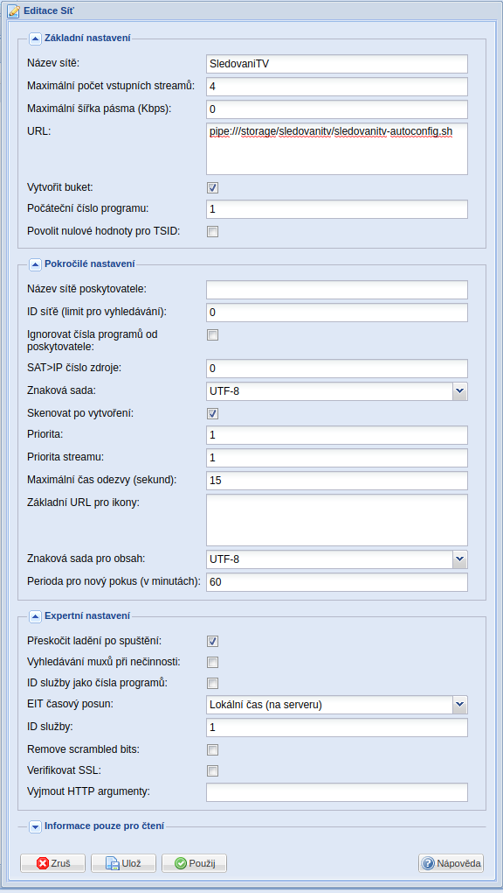
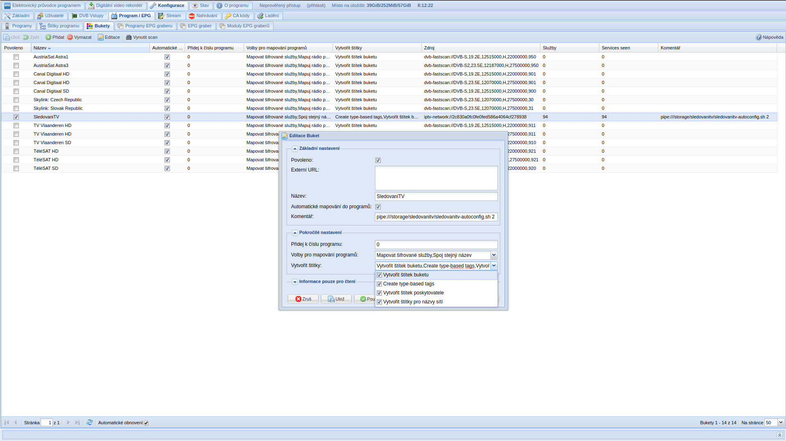
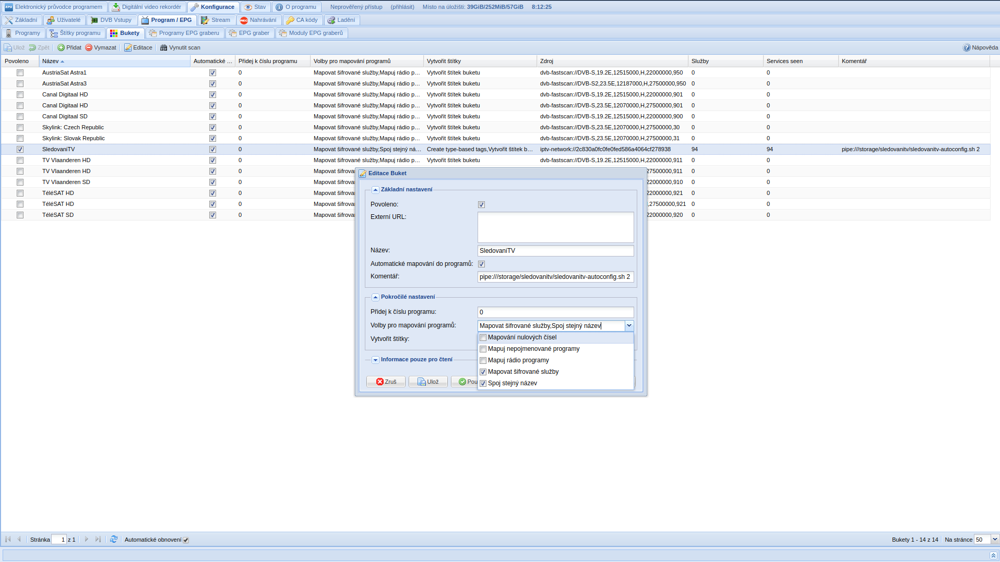
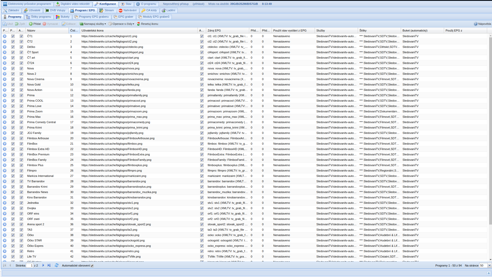

# sledovanitv

Jako výchozí podklad jsem použil skript od JiRo (XMBC-Kodi.cz)

Soubor skriptu pro implementaci SledovaniTV.cz do tvheadendu a kodi. Diky implementaci do tvheadendu funguje je nahravani a timeshift
Podporovano je prehravani a EPG

- sledovanitv-autoconfig.sh - je pipe pro automatickou konfiguraci IPTV site
- sledovanitv-epg.sh - na stdout jde EPG celeho sledovanitv na 1 den dopredu 1439s
- sledovanitv-register.sh - slouží k počáteční registraci zařízení

## Postup zprovoznění

### Instalace

Pro Kodi v AmLogic 912/ Linux
- v adresáři $HOME vytvořit adresář _sledovanitv_ (/storage/sledovanitv)
- nahrát do něj soubory z githubu, musí mít právo na spuštění (chmod +x /storage/sledovanitv/sledovanitv*.sh /storage/sledovanitv/sledovanitv*.py)
- v KODI instalovat balíčky: System Tools, FFmpeg tools, tvheadend server
- nastaveni casove zony systemu, neplest s TZ v KODI!    echo "TIMEZONE=Europe/Prague" > /storage/.cache/timezone 

### Registrace zařízení

- cd $HOME/sledovanitv
- ./sledovanitv-register.sh   vyplnit přihlašovací údaje do sledovánítv. Skript vytvoří nový soubor config.json s authentizačními údaji pro zařízení

### Zprovoznění EPG

Z důvodu, že sledování má kanály pojmenované různě, tak je vhodné nejdříve uprovoznít EPG, které obsahuje identifikátory jednotlivých kanálů

- v konfiguraci doplnku tvh-server, nastavit v XMLTV: 
  - XMLTV source type: SCRIPT
  - XML Script location vybrat sledovanitv-epg.sh
- přihlásit se do webu tvh-serveru http://kodi:9981/
- v části Konfigurace/Program EPG/Moduly EPG grabberů povolit _Interní XMLTV: tv_grab_file is a simple grabber that can be configured through the addon settings from Kodi_
- restartovat tvh-server - zakázat/povolit doplněk
- chvíli počkat
- zpět do webu a v části Konfigurace/Program EPG/Programy EPG grabberů by jste měli vidět seznam všech kanálů v sledovánítv. i těch na které nemáte právo.

### Zprovoznění kanálu

Postup je zcela odlisny od predchozi koncepce, kdy se vkladaly jednotlive MUXy rucne. Ted jsou vlozeny playlistem z M3U8 souboru, ktery je generovany skriptem sledovenitv-autoconfig.sh

- Konfigurace/DVB vstupy/Sítě přidat novou Atuomatic IPTV Network
  - název: SledováníTV
  - max pocet streamu: 4
  - vytvorit buket: true
  - Pocatecni cislo programu: 1
  - Ignorovat čísla programů od poskytovatele: false
  - znakova sada: UTF-8
  - skenovat po vytvoreni :false   
  - preskocit ladeni po startu: true
  - EIT casovy posun: lokalni cas (na serveru)
  - Service ID: 1
  - URL: pipe:///storage/sledovanitv/sledovanitv-autoconfig.sh
  
  Po ulozeni se vytvori muxy a sluzby.

  !!!! NESMI SE SPUSTIT SKENOVANI ODKUDKOLIV !!!!
  Je to z toho duvodu, ze skenovani prepise nazvy sluzeb a pri dalsim nacteni playlistu se vsechny muxy a sluzby smazou a znovu vytvori, protoze nesedi nazvy sluzeb

- Konfigurace Buketu
  Vytvori nazev buketu podle nazvu site
  - Povoleno: true
  - Volby mapovani programu:
    - sifrovane
    - spoj stejny nazev
  - Vytvorit stitky
    - vsechno zvolit
 
- Konfigurace stitku
  Povolit si co chcete a pripadne nastavit interni a privatni

## Installace na samostatný tvheanded server bez kodi

Pro tvheanded na samostatném serveru (raspberry pi zero 2W + Raspberry Pi OS)
- doinstalovat tv_grab_file grabber dle postupu z https://github.com/b-jesch/tv_grab_file  
- nutno naklonovat scripty do /home/hts a vytvořit složku /home/hts/.cache
- EPG grabber nutno spouštět cronem a načítata xml soubor /home/hts/sledovanitv/sledovanitv-epg-cron.xml, nikoliv script sledovanitv-epg.sh (cron spouštím 3min před spouštěním interních epg grabberů v tvheandedu)
  - 1 */12 * * * /bin/bash /home/hts/sledovanitv/sledovanitv-epg.sh > /home/hts/sledovanitv/sledovanitv-epg-cron.xml
- jinak je postup zprovoznění totožný
- 
## DOCKER

Pro jednodussi start v Linuxu

- Sestaveni docker imahe
  docker build -t TVHSledovaniTV .
- Spusteni docker image mam 2 adresare config a recordings pro ukladani persistentnich dat, pozor je poterba mit spravna prava, aby vnitrni procesy videly na adresa
```bash
  chown -R 1000:1000 config recordings  
  docker run -d --name tvheadend -e PUID=1000 -e PGID=1000 -p 9981:9981 -p 9982:9982 -v ${PWD}/config:/config -v ${PWD}/recordings:/recordings TVHSledovaniTV
```


## Troubleshooting

- pokud se něco v kodi neprojeví, ale je to vidět v TVH-serveru, tak restart KODI poumůže, stačí KODI, nemusí se celý přehrávač
- v WWW je dole lišta, která když se rozbalí, tak je vidět LOG TVH-serveru
- v sh skriptem můžete udělat debug pomoci přídaní -x na první řádek, výstup opět do logu TVH-serveru
- pokud chcete vyvolat okamzite znovu-nacteni playlistu, tak staci si dat neco jako parametr ke skriptu do URL a ten parametr pripadne menit


Nastaveni site


Nastaveni Bucketu




Jak to ma vypadat

